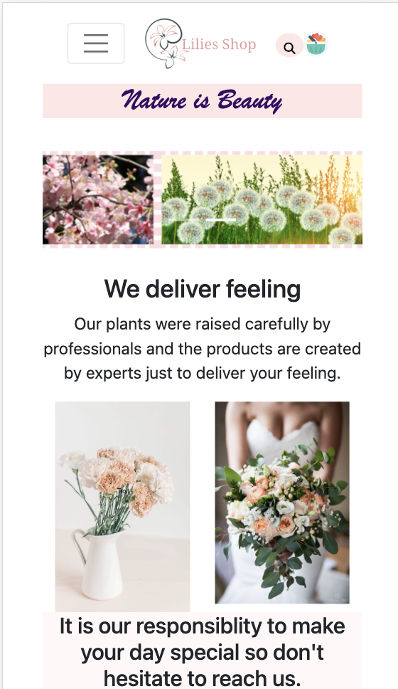
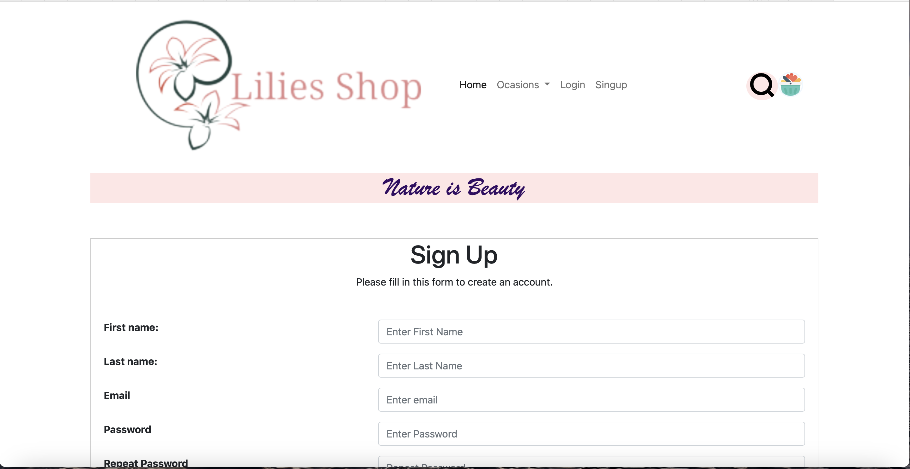

<!-- Introduction -->
# Introduction 
This is a simple business website for flower shop, It alows you to search for the shops servises and order requirment via any of the contact detail provided.

## Project Title
Lilies Shop

## Design
The website designed to be responsive according to the device(PC,Ipad or smartphones)

## Web pages
### index(Home) page
The home page is the landing page that introduces the website and it's services to customers.
## Login page
This page contains login form for the members that signed up in the website and allows them to login to their account.
## Signup page
The signup page is basic signup form for none member to complete when they want to register.
## book page
The booking page is to send your enquiry and be contacted back with the preferable methode.

# Testing

### description of test plan
### Test on different devises
* Laptop

* smartphone

### Test on diffrent browsers
* Safari

*  Chrome (I didn't upload screenshot for chrom as the previous one for laptop was taken from chrome browser).

## Language validation
 Html
 https://validator.w3.org

 CSS
https://jigsaw.w3.org/css-validator/validator

## Test web page links
<!-- Tables -->
| Test No   | Purpose| Test and Or data|Expected Outcome|Actual Outcome|Comments|
| --------  | -------- |-------- |--------|--------|--------|
| 1         |Home page |Links functional test|Lunch home page|All links lunched Home page| N/A |
| 2         |Login page|Links functional test|Lunch login page|  All links lunched | N/A     |
| 3         |Signup page|Links functional test|Lunch signup page|  All links lunched | N/A     |
| 4         |booking page|Links functional test|Lunch booking page|  All links lunched | N/A   |

## Test web responsivness
<!-- Tables -->
| Test No  | Test     |Expected Outcome|Actual Outcome|Comments|
| -------- | -------- |--------|--------|--------|
| 1        |Display test for all pages on a Laptop|All web pages should display with no distortion|All pages displayed correctly|  N/A |
| 2        |Display test for all pages on smartphone|All web pages should display with no distortion|All pages displayed correctly| N/A     |
| 3        |Display test for all pages on tablet|All web pages should display with no distortion|  All pages displayed correctly | N/A   |

# Bugs and problems encountered
My most chalenging task was the search bar button as it was hard to fix it as drop down searchbar. I couldn't find any sorce to guid me during the prosess only some youtibe video to display it as a circle button.

# Code attribution
## bootstrap library
This website played a big roll in designing and creating my pages such as navigation bar,slidding banner,form and other details.
## W3school
This website was a valuable library for me and great support for writing my codes.
## Logo maker
There are many websites for logo.However I used this one https://www.adobe.com/express/create/logo
to creat the logo of my page it was usefull and searved the purpose.

# Screenshots

