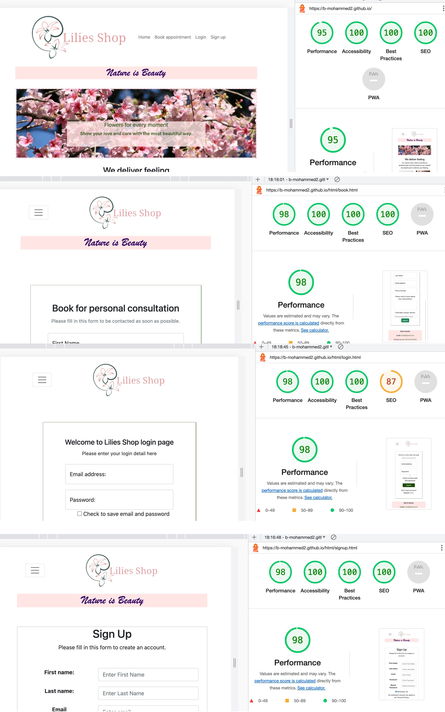

<!-- Introduction the purpose and the value to users and dyployment -->

# Introduction 
This is a simple business website for flower shop, It allows you to search for the shops services and order requirement for events special days or loved one's via any of the contact detail provided.
<!-- users stories -->
## User stories
### First Time Visitor Goals

1. I want to be able to navigate to the different sections of the website to gain a basic knowledge of what Lilies shop offers. 
2. As a first time visitor, I want to easily understand the main purpose of the site and learn more about the different events and offers that the business provides.
3. As a first time visitor, I want them to make contact to get advice and help with planing and book for my event. I would like to follow the business on the different social media 
I would like to be able to find contact detail to contact them directly.
4. As a first time visitor, I want customer be able to create account and receive special offers for regular customers and save their details for saving time.

### Returning Visitor Goals

1. As a Returning Visitor, I want customers to use the booking function on the website to book for their requirement..
2. As a Returning Visitor, I want customers to learn  about the new offers and services the business provides.
3. As a Returning Visitor, I want customers to login to their created account .

### Frequent User Goals

1. As a Frequent User, I want customers to book consultation for events through the contact form or a phone. 
2. As a Frequent User, I want customers to make contact with us through the website about any issues or complain, so we can help.

## Project Title
Lilies Shop

## Design
The website designed to be responsive according to the device(PC, iPad or smartphones)

## Wireframe
#### Desktop
Design for PC and laptop or any similar devices.

#### iPad
Design for iPad and tablet devices.

#### Smartphone
Design for smartphones.

## Web pages
### index(Home) page
The home page is the landing page that introduces the website and it's services to customers.
### Login page
This page contains login form for the members that signed up on the website and allows them to login to their account.
### Sign up page
The sign up page is basic sign up form for none member to complete when they want to register.
### booking page
The booking page is to send your inquiry and be contacted back with the preferable method.

## Lighthouse Report

#### Desktop

#### Mobile

# Testing

### description of test plan
### Test on different devises
#### virtual device tests
websites used to test pages and responsiveness.
1. https://ui.dev/amiresponsive?url=http%3A%2F%2Fblog.codecamp.jp&__hstc=150021993.fdd75ffbe5522a13e5a117f14d997ae5.1473078813729.1473078813729.1473078813730.2&__hssc=150021993.1.1473078813730&__hsfp=3801984517.

2. http://responsivetesttool.com

#### Actual devise tests
* Laptop

* Tablet

### Test on different browsers
The following web browsers were used to test the display of the website including the functionality of the forms.
* Safari
* Chrome 
* Edge
* Opera

## Language validation
 Html
 https://validator.w3.org

 
 
 
 

 CSS
 https://jigsaw.w3.org/css-validator/validator

 

## Lighthouse check

## Test web page links
<!-- Tables -->
| Test No   | Purpose| Test and Or data|Expected Outcome|Actual Outcome|Comments|
| --------  | -------- |-------- |--------|--------|--------|
| 1         |Home page |Links functional test|Lunch home page|All links lunched Home page| N/A |
| 2         |Login page|Links functional test|Lunch login page|  All links lunched | N/A     |
| 3         |Sign up page|Links functional test|Lunch sign up page|  All links lunched | N/A     |
| 4         |booking page|Links functional test|Lunch booking page|  All links lunched | N/A   |

## Test web responsiveness
<!-- Tables -->
| Test No  | Test     |Expected Outcome|Actual Outcome|Comments|
| -------- | -------- |--------|--------|--------|
| 1        |Display test for all pages on a Laptop|All web pages should display with no distortion|All pages displayed correctly|  N/A |
| 2        |Display test for all pages on smartphone|All web pages should display with no distortion|All pages displayed correctly| N/A     |
| 3        |Display test for all pages on tablet|All web pages should display with no distortion|  All pages displayed correctly | N/A   |

# Bugs and problems encountered
I had trouble with images for the slide as with sliding the picture size was changing. So I tried to find images with the same size or as close as possible to fit the banner.

# Code attribution
## bootstrap library
This website played a big roll in designing and creating my pages such as navigation bar, sliding banner, form and other details.
## W3school
This website was a valuable library for me and great support for writing my codes.
## Logo maker
There are many websites for logo.However, I used this one https://www.adobe.com/express/create/logo
to create the logo of my page it was useful and served the purpose.

## Image source
I have used the images from those resources to serve my need during the project.
1. https://www.pinterest.es/pin/peach-english-garden-roses-peach-ranunculus-white-lisianthus-white-gypsophila-baby-blue-eucaly--540432024020357846/
2. https://weddings.bouqs.com/collections/dried/products/lace-ceremony-piece
3. https://www.cultfurniture.com/accessories-c13/wildflower-bouquet-hand-tied-p41158
4. https://unsplash.com/photos/UDXB7_WLDjY
5. https://fleursamanda.co.uk/product/valentines-day-red-roses/
Banners
6. https://www.descansogardens.org/wp-content/uploads/2016/07/Cherry-blossom-banner-1400x400.jpg
7. https://www.mub.eps.manchester.ac.uk/science-engineering/wp-content/uploads/sites/59/2021/07/Summer-Science-1400x400.jpg

## Deployment

I deployed the website on GitHub platform after making a repository and uploading all the files to it.
GitHub has special requirement with naming the repository for deployment as it needs to be written in this form
 account-holders-name.github.io 
It is important to mention that you can not deploy more than one repository in the same time on GitHub. If you already have a deployed repository you need to stop it by changing the name and deploy the required repository the same way mentioned in the top
There are other platforms for deployment such as (Go dady)
Another important step is the index.html file should be in the root folder to be successfully deployed.
It is important to mention that you can not deploy more than one repository in the same time on GitHub. If you already have a deployed repository you need to stop it by changing the name and deploy the required repository the same way mentioned in the top.

## There are other platform 
https://seodesignchicago.com/web-design-blog/the-5-steps-of-website-deployment/

## Link to the repository
https://github.com/B-Mohammed2/B-Mohammed2.github.io

## Live link to the project
https://b-mohammed2.github.io/

